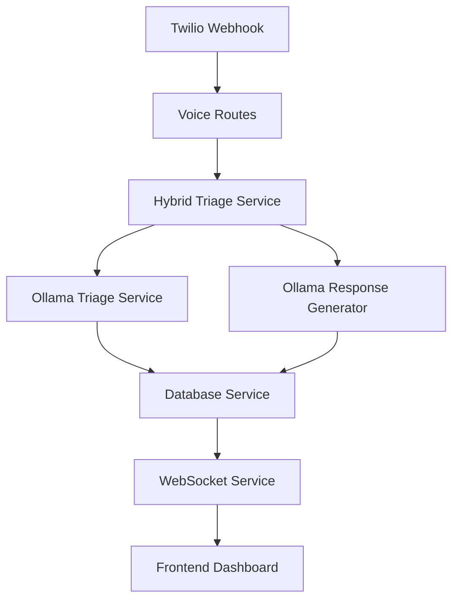

# HackAura Backend Documentation

## 📋 Overview

The HackAura backend is a FastAPI-based emergency triage system that provides AI-powered emergency classification, natural language processing, and real-time response generation.

## 🏗️ Architecture

### Core Services



### Service Components

- **Hybrid Triage Service**: Main orchestration with conversation flow
- **Ollama Triage Service**: AI-powered emergency classification
- **Ollama Response Generator**: Natural language safety responses
- **Twilio Service**: Voice call handling and TwiML generation
- **Database Service**: Call records and analytics storage
- **WebSocket Service**: Real-time frontend updates

## 📁 Directory Structure

```
backend/
├── main.py                    # FastAPI application entry point
├── routes/
│   ├── voice.py              # Voice and triage endpoints
│   └── ...
├── services/
│   ├── hybrid_triage_service.py      # Main triage orchestration
│   ├── ollama_triage_service.py      # AI classification engine
│   ├── ollama_response_generator.py  # Safety response generation
│   ├── twilio_service.py             # Voice integration
│   ├── database_service.py           # Database operations
│   ├── websocket_service.py          # Real-time updates
│   └── ...
├── models/
│   ├── emergency_schema.py    # Emergency type definitions
│   ├── database.py           # Database models
│   └── ...
├── config/
│   └── settings.py           # Configuration management
├── requirements.txt          # Python dependencies
└── README.md                # This file
```

## 🚀 Quick Start

### 1. Installation

```bash
# Install Python dependencies
pip install -r requirements.txt

# Setup Ollama (if not already installed)
# Download from https://ollama.ai
ollama pull qwen2.5:0.5b

# Warm up Ollama models
python warmup_ollama.py
```

### 2. Configuration

Create `.env` file:

```env
# Ollama Configuration
OLLAMA_MODEL=qwen2.5:0.5b
OLLAMA_HOST=localhost:11434

# Server Configuration
HOST=0.0.0.0
PORT=8000
DEBUG=false

# Database Configuration
DATABASE_URL=sqlite:///hackaura.db

# Twilio Configuration (optional)
TWILIO_ACCOUNT_SID=your_account_sid
TWILIO_AUTH_TOKEN=your_auth_token
TWILIO_PHONE_NUMBER=your_phone_number

# AI Assistant Configuration
AI_ASSISTANT_NAME=HackAura
AI_ASSISTANT_VOICE=alice
SPEECH_TIMEOUT=5
```

### 3. Start Server

```bash
python main.py
```

Server will start on `http://localhost:8000`

## 🔧 Core Services

### Hybrid Triage Service (`hybrid_triage_service.py`)

**Purpose**: Main orchestration service that combines instant classification with AI safety responses.

**Key Features**:
- Instant rule-based emergency classification
- AI-generated natural language responses
- Conversation flow management
- Follow-up question handling

**Usage**:
```python
from services.hybrid_triage_service import hybrid_triage_service

result = await hybrid_triage_service.process(
    transcript="There's a fire in my kitchen",
    call_sid="call_123",
    is_followup=False
)
```

**Response Structure**:
```json
{
  "category": "Fire",
  "priority": 1,
  "reasoning_byte": "Fire emergency detected",
  "processing_time_ms": 85.0,
  "what_to_say": "Help is coming! Fire department is being dispatched...",
  "immediate_actions": ["Evacuate immediately", "Do not use elevators"],
  "safety_precautions": ["Stay low to avoid smoke", "Feel doors before opening"],
  "dispatched_service": "Fire Department",
  "status": "AWAITING_FOLLOWUP"
}
```

### Ollama Triage Service (`ollama_triage_service.py`)

**Purpose**: AI-powered emergency classification using Ollama models.

**Key Features**:
- Sub-100ms processing time
- Emergency type classification
- Severity level assessment
- Confidence scoring

**Usage**:
```python
from services.ollama_triage_service import ollama_triage_service

triage_result = await ollama_triage_service.process(
    "Car accident on highway with injuries"
)
```

**Emergency Types**:
- `MEDICAL`: Heart attacks, strokes, injuries
- `FIRE`: Building fires, explosions, smoke
- `POLICE`: Crimes, assaults, dangerous situations
- `ACCIDENT`: Car crashes, traffic incidents
- `MENTAL_HEALTH`: Crisis situations
- `OTHER`: General emergencies

### Ollama Response Generator (`ollama_response_generator.py`)

**Purpose**: Generate natural language safety responses and guidance.

**Key Features**:
- Natural speech generation
- Context-aware safety instructions
- Emergency-specific guidance
- Caller reassurance

**Usage**:
```python
from services.ollama_response_generator import ollama_response_generator

response = ollama_response_generator.generate_voice_response(triage_result)
```

**Response Structure**:
```json
{
  "voice_response": "Help is coming! Emergency services are being dispatched...",
  "safety_precautions": ["Move to safe location", "Call emergency services"],
  "immediate_actions": ["Evacuate area", "Check for injuries"],
  "caller_guidance": "Help is on the way. Stay calm and follow instructions.",
  "is_life_threatening": true
}
```

### Twilio Service (`twilio_service.py`)

**Purpose**: Handle Twilio voice calls and generate TwiML responses.

**Key Features**:
- Incoming call handling
- Speech recognition setup
- TwiML response generation
- Voice response integration

**Key Methods**:
- `generate_emergency_speech_response()`: Initial call handling
- `generate_emergency_safety_response()`: Safety response with AI
- `generate_emergency_retry_response()`: Retry on unclear input

## 📊 API Endpoints

### Voice & Triage Endpoints

#### `POST /api/voice/ultra-fast`
Process emergency text and return triage results.

**Request**:
```bash
curl -X POST http://localhost:8000/api/voice/ultra-fast \
  -F "text=There's a fire in my kitchen"
```

**Response**:
```json
{
  "category": "Fire",
  "priority": 1,
  "reasoning_byte": "Fire emergency detected",
  "processing_time_ms": 85.0,
  "what_to_say": "Help is coming! Fire department is being dispatched...",
  "immediate_actions": ["Evacuate immediately", "Do not use elevators"],
  "safety_precautions": ["Stay low to avoid smoke", "Feel doors before opening"],
  "dispatched_service": "Fire Department",
  "status": "AWAITING_FOLLOWUP",
  "confidence": 0.95
}
```

#### `POST /api/voice/ultra-fast/followup`
Handle follow-up responses in conversation flow.

**Request**:
```bash
curl -X POST http://localhost:8000/api/voice/ultra-fast/followup \
  -F "SpeechResult=yes" \
  -F "CallSid=call_123"
```

#### `GET /api/voice/ultra-fast/calls`
Get recent emergency calls for dashboard.

**Response**:
```json
{
  "success": true,
  "calls": [
    {
      "id": 1,
      "call_sid": "call_123",
      "category": "Fire",
      "priority": 1,
      "summary": "Fire emergency detected",
      "processing_time_ms": 85.0,
      "created_at": "2026-02-14T12:00:00Z"
    }
  ],
  "total": 1
}
```

#### `GET /api/voice/ultra-fast/stats`
Get processing statistics.

**Response**:
```json
{
  "success": true,
  "stats": {
    "total_calls": 150,
    "avg_processing_time_ms": 85.5,
    "min_ms": 45.2,
    "max_ms": 343.1
  }
}
```

### Utility Endpoints

#### `GET /health`
Health check endpoint.

**Response**:
```json
{
  "status": "healthy",
  "service": "HackAura Backend",
  "version": "1.0.0",
  "ollama_status": "connected"
}
```

## 🗄️ Database Schema

### CallRecord Model

```python
class CallRecord(Base):
    id = Column(Integer, primary_key=True)
    call_sid = Column(String(100), unique=True)
    from_number = Column(String(20))
    transcript = Column(Text)
    emergency_type = Column(Enum(EmergencyType))
    severity_level = Column(Enum(SeverityLevel))
    priority = Column(Integer)
    confidence = Column(Float)
    processing_time_ms = Column(Float)
    created_at = Column(DateTime)
    call_metadata = Column(JSON)
```

### Emergency Types

- `MEDICAL`: Medical emergencies
- `FIRE`: Fire-related emergencies
- `POLICE`: Police emergencies
- `ACCIDENT`: Accident emergencies
- `MENTAL_HEALTH`: Mental health crises
- `OTHER`: Other emergencies

### Severity Levels

- `LEVEL_1`: Critical (life-threatening)
- `LEVEL_2`: High (serious)
- `LEVEL_3`: Moderate (injuries)
- `LEVEL_4`: Low (minor)

## 🧪 Testing

### Unit Tests

```bash
# Test individual services
python -m pytest tests/test_services.py

# Test API endpoints
python -m pytest tests/test_api.py
```

### Integration Tests

```bash
# Test complete flow
python test_complete_flow.py

# Test Ollama integration
python warmup_ollama.py
```

### Manual Testing

```bash
# Test health endpoint
curl http://localhost:8000/health

# Test triage endpoint
curl -X POST http://localhost:8000/api/voice/ultra-fast \
  -F "text=Heart attack, can't breathe"
```

## 🔍 Debugging

### Logging

The backend uses comprehensive logging:

```python
import logging
logger = logging.getLogger(__name__)

logger.info("Processing emergency call")
logger.error("Error processing call", exc_info=True)
```

### Common Issues

1. **Ollama Connection Failed**
   - Check Ollama is running: `ollama list`
   - Verify model is downloaded: `ollama pull qwen2.5:0.5b`
   - Check network connectivity

2. **Database Errors**
   - Check database file permissions
   - Verify database URL in configuration
   - Check SQLAlchemy connection

3. **Twilio Webhook Issues**
   - Verify webhook URL is accessible
   - Check Twilio configuration
   - Test with ngrok for local development

## 🚀 Deployment

### Development

```bash
python main.py
```

### Production

```bash
# Using Gunicorn
gunicorn main:app -w 4 -k uvicorn.workers.UvicornWorker

# Using Docker
docker build -t hackaura-backend .
docker run -p 8000:8000 hackaura-backend
```

### Environment Variables

Required for production:
- `OLLAMA_MODEL`: AI model to use
- `DATABASE_URL`: Production database URL
- `TWILIO_ACCOUNT_SID`: Twilio account SID
- `TWILIO_AUTH_TOKEN`: Twilio auth token

## 📈 Performance

### Optimization Features

- **Sub-100ms Processing**: Optimized Ollama calls
- **Connection Pooling**: Database connection reuse
- **Caching**: Model warmup and response caching
- **Async Processing**: Non-blocking I/O operations

### Monitoring

- Processing time metrics
- Error rate tracking
- API response monitoring
- Database performance

## 🔒 Security

### Input Validation

- Sanitized user inputs
- SQL injection prevention
- XSS protection
- Rate limiting

### Data Protection

- Encrypted sensitive data
- Secure API keys
- Audit logging
- Access controls

## 📚 Additional Resources

- [FastAPI Documentation](https://fastapi.tiangolo.com/)
- [Ollama Documentation](https://ollama.ai/)
- [Twilio API Documentation](https://www.twilio.com/docs/)
- [SQLAlchemy Documentation](https://docs.sqlalchemy.org/)

---

For specific implementation details, see the individual service files in the `services/` directory.
